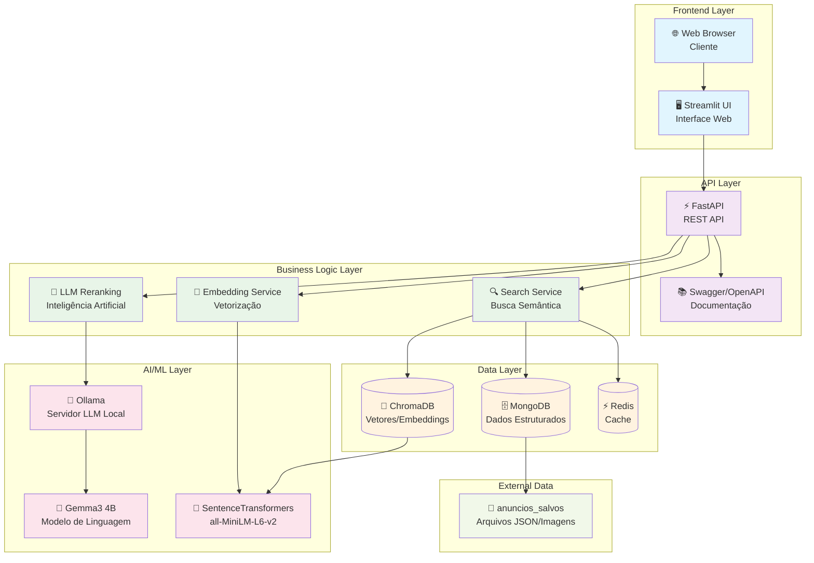
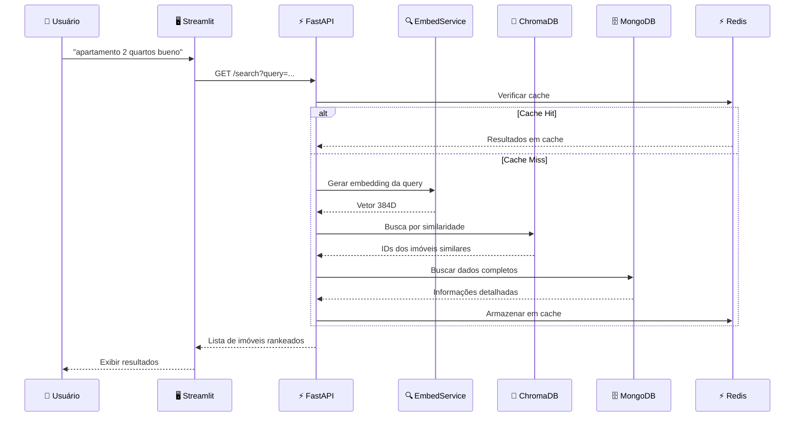
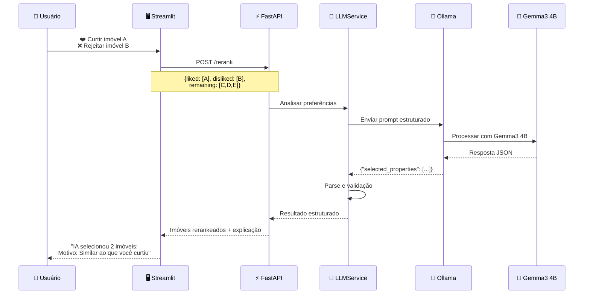
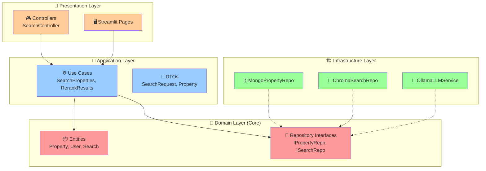
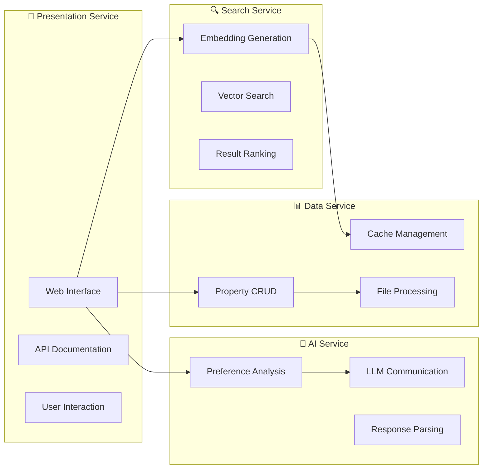
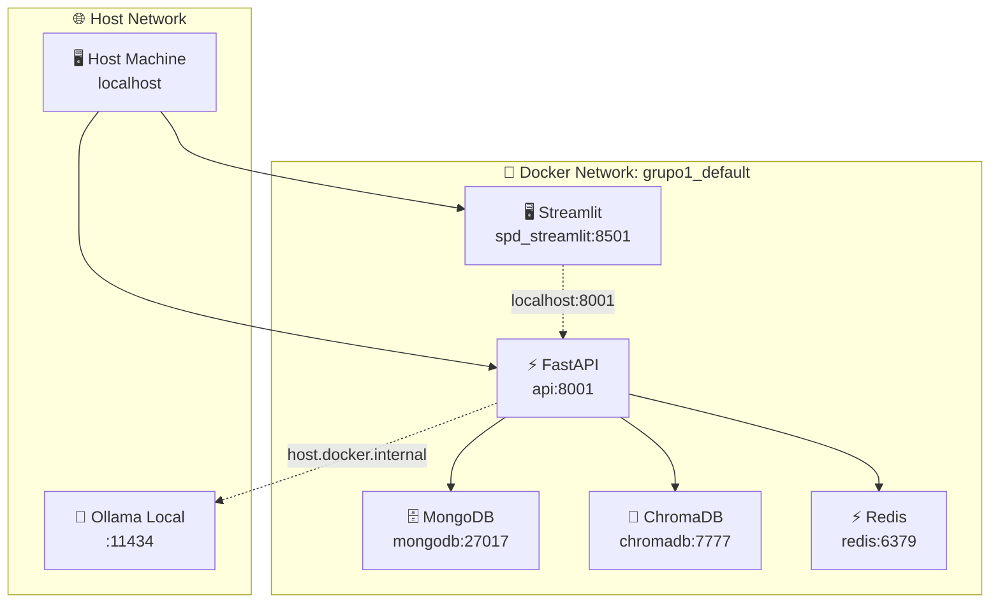
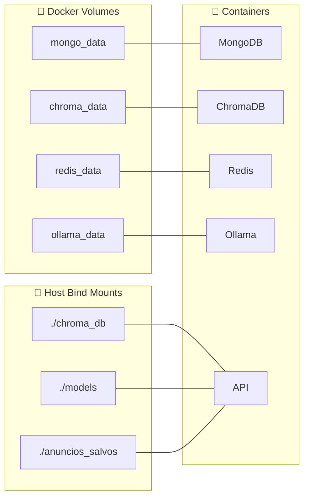
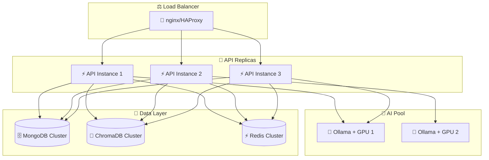

# 🏗️ Arquitetura do Sistema SPD Imóveis

## 📋 Visão Geral da Arquitetura

## 🔄 Fluxo de Dados Principal

### 1. Busca Semântica

### 2. Reranking Inteligente

## 🏛️ Padrões Arquiteturais

### Clean Architecture

### Microserviços e Responsabilidades

## 🔧 Configuração de Deploy

### Docker Networking

### Volumes e Persistência

## 📈 Escalabilidade e Performance

### Horizontal Scaling

### Otimizações Implementadas

1. **🚀 Cache Strategy**
   - Redis para consultas frequentes
   - TTL configurável por tipo de dados
   - Cache warming para queries populares

2. **🔮 Vector Optimization**
   - Embeddings pré-computados
   - Índices otimizados no ChromaDB
   - Batch processing para novos dados

3. **🤖 AI Optimization**
   - Modelo local para baixa latência
   - Context window otimizado
   - Response streaming quando possível

4. **📊 Database Tuning**
   - Índices compostos no MongoDB
   - Connection pooling
   - Query optimization

---

Esta arquitetura garante alta performance, escalabilidade e manutenibilidade do sistema SPD Imóveis.