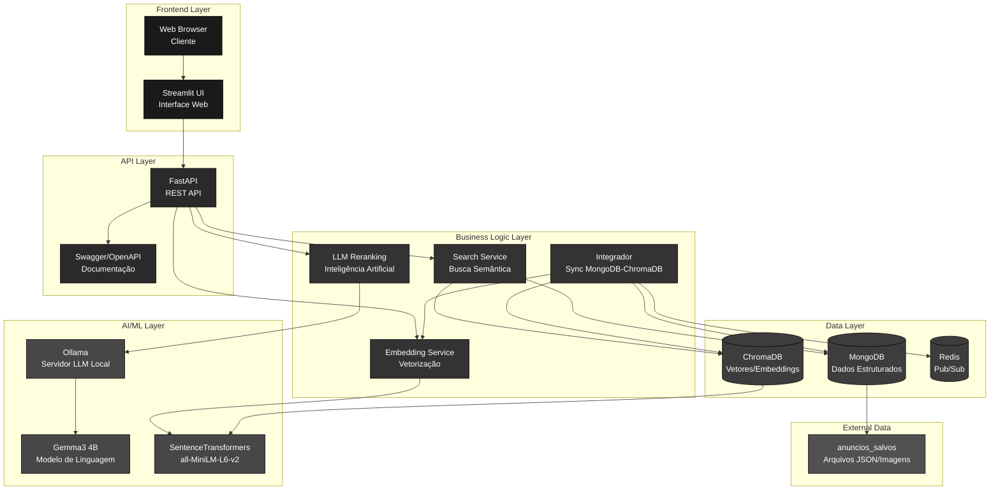
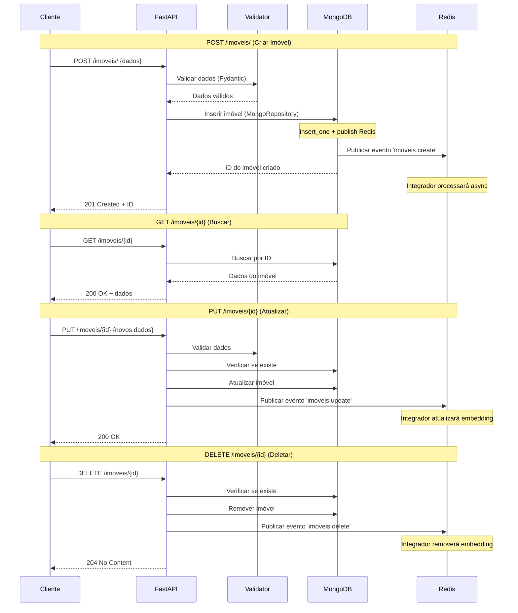
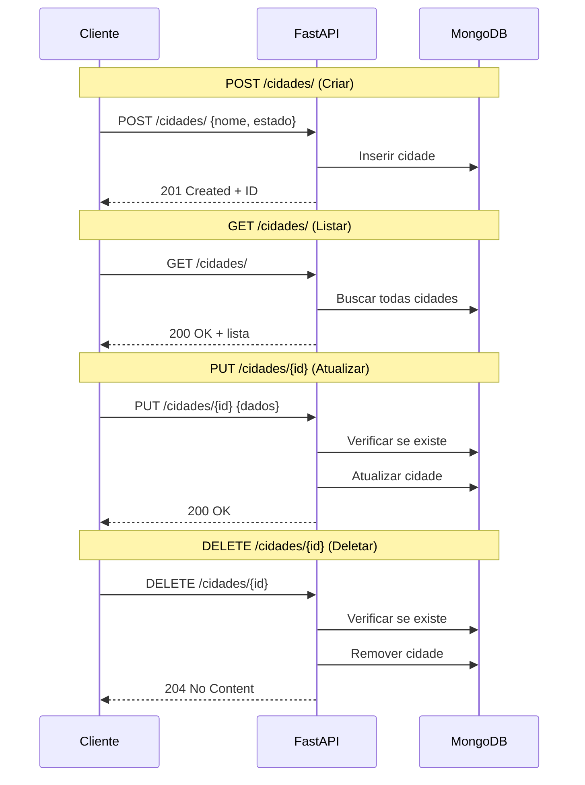
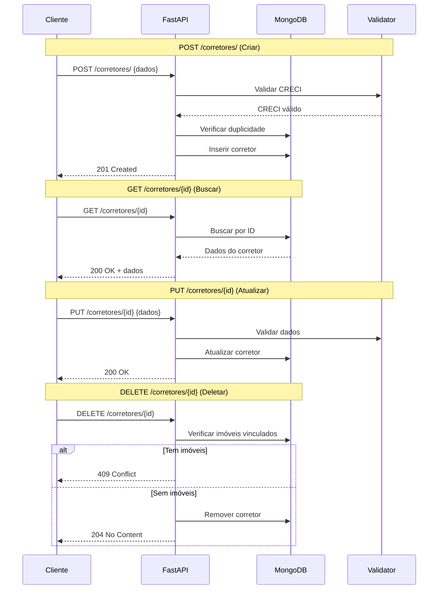
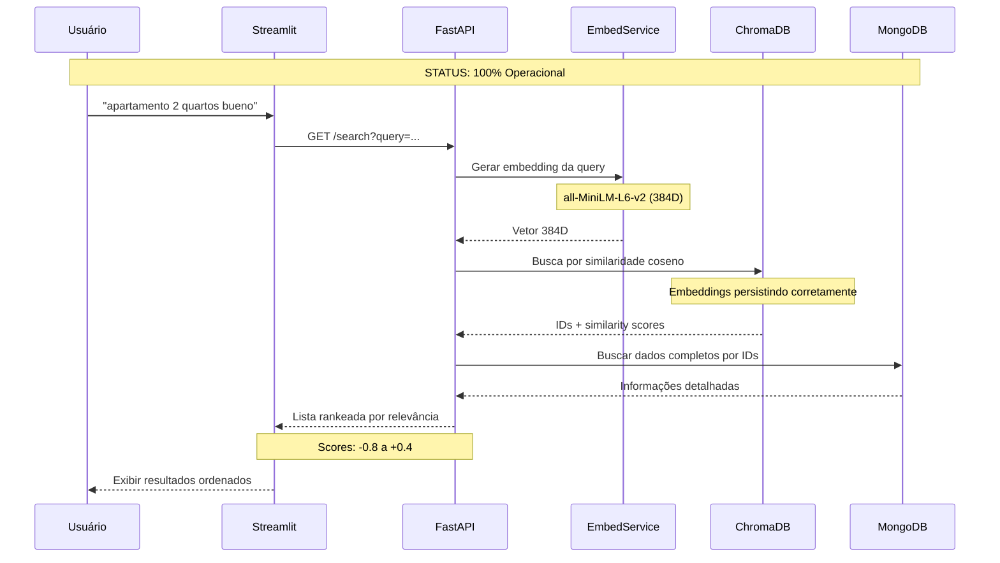
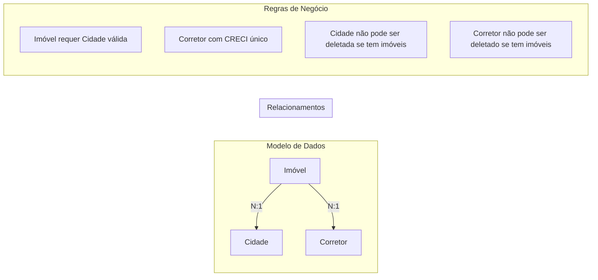
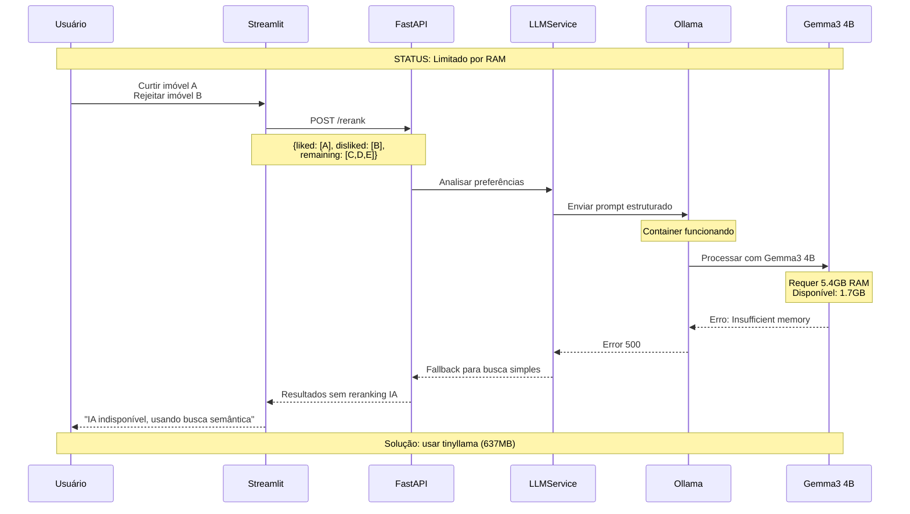
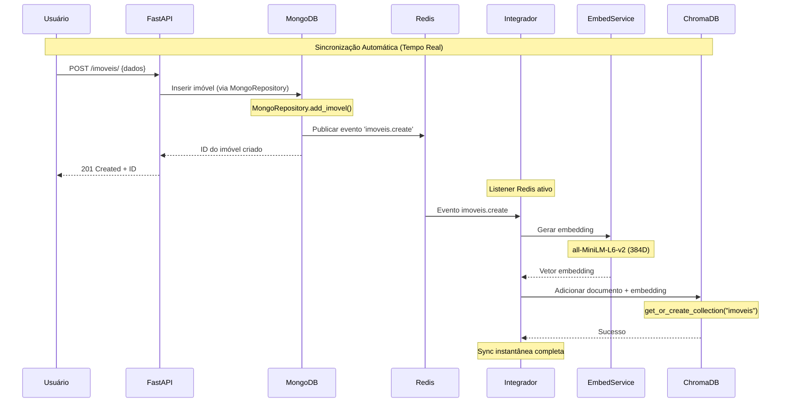
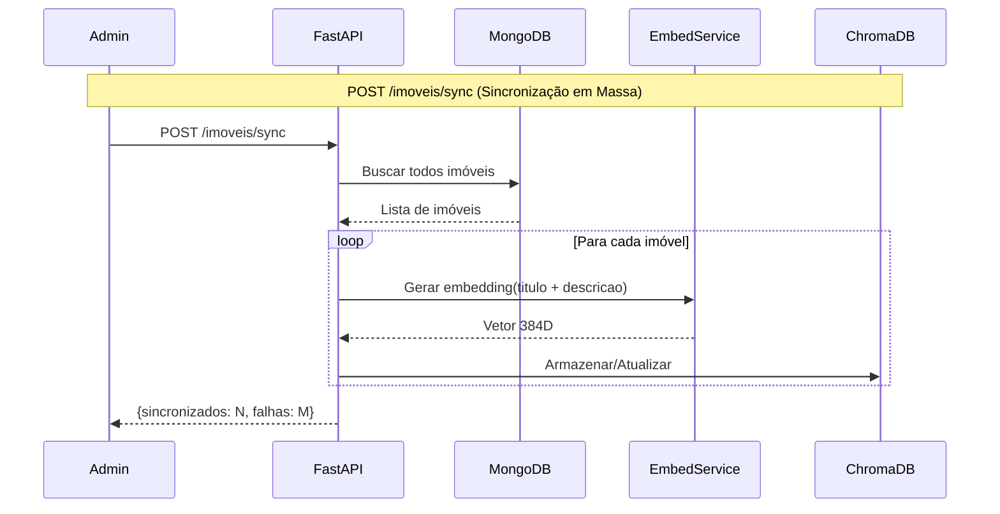
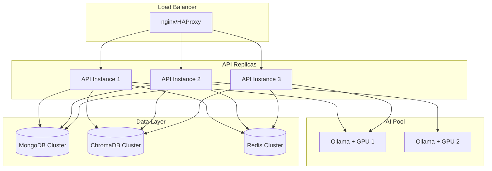

# Arquitetura do Sistema SPD Imóveis
- ChromaDB com embeddings 384D funcionando perfeitamente
- Busca semântica operacional com ranking por similaridade
- Sincronização MongoDB → Redis → Integrador → ChromaDB em tempo real
- CRUD completo de imóveis, cidades e corretores
- Reranking IA limitado por RAM (Gemma3 4B requer 5.4GB, disponível: 1.7GB)

## Visão Geral da Arquitetura

```mermaid
graph TB
    %% Frontend Layer
    subgraph "Frontend Layer"
        UI[Streamlit UI<br/>Interface Web]
        WEB[Web Browser<br/>Cliente]
    end
    
    %% API Layer
    subgraph "API Layer"
        API[FastAPI<br/>REST API]
        DOCS[Swagger/OpenAPI<br/>Documentação]
    end
    
    %% Business Logic Layer
    subgraph "Business Logic Layer"
        SEARCH[Search Service<br/>Busca Semântica]
        RERANK[LLM Reranking<br/>Inteligência Artificial]
        EMBED[Embedding Service<br/>Vetorização]
        INTEGRADOR[Integrador<br/>Sync MongoDB-ChromaDB]
    end
    
    %% Data Layer
    subgraph "Data Layer"
        MONGO[(MongoDB<br/>Dados Estruturados)]
        CHROMA[(ChromaDB<br/>Vetores/Embeddings)]
        REDIS[(Redis<br/>Pub/Sub)]
    end
    
    %% AI/ML Layer
    subgraph "AI/ML Layer"
        OLLAMA[Ollama<br/>Servidor LLM Local]
        GEMMA[Gemma3 4B<br/>Modelo de Linguagem]
        SENTENCE[SentenceTransformers<br/>all-MiniLM-L6-v2]
    end
    
    %% External Layer
    subgraph "External Data"
        FILES[anuncios_salvos<br/>Arquivos JSON/Imagens]
    end
    
    %% Connections
    WEB --> UI
    UI --> API
    API --> DOCS
    
    API --> SEARCH
    API --> RERANK
    API --> EMBED
    
    SEARCH --> CHROMA
    SEARCH --> MONGO
    
    RERANK --> OLLAMA
    EMBED --> SENTENCE
    
    INTEGRADOR --> REDIS
    INTEGRADOR --> MONGO
    INTEGRADOR --> CHROMA
    INTEGRADOR --> EMBED
    
    OLLAMA --> GEMMA
    
    MONGO --> FILES
    CHROMA --> SENTENCE
    
    %% Styling
    classDef frontend fill:#1a1a1a,stroke:#000,color:#fff
    classDef api fill:#2a2a2a,stroke:#000,color:#fff
    classDef business fill:#333333,stroke:#000,color:#fff
    classDef data fill:#3d3d3d,stroke:#000,color:#fff
    classDef ai fill:#474747,stroke:#000,color:#fff
    classDef external fill:#515151,stroke:#000,color:#fff
    
    class UI,WEB frontend
    class API,DOCS api
    class SEARCH,RERANK,EMBED,INTEGRADOR business
    class MONGO,CHROMA,REDIS data
    class OLLAMA,GEMMA,SENTENCE ai
    class FILES external
```

## Fluxo de Dados Principal

### 1. Fluxos CRUD (Create, Read, Update, Delete)

#### 1.1 CRUD de Imóveis

```mermaid
sequenceDiagram
    participant C as Cliente
    participant API as FastAPI
    participant V as Validator
    participant MD as MongoDB
    participant RD as Redis
    
    Note over C,RD: POST /imoveis/ (Criar Imóvel)
    C->>API: POST /imoveis/ {dados}
    API->>V: Validar dados (Pydantic)
    V-->>API: Dados válidos
    API->>MD: Inserir imóvel (MongoRepository)
    Note over MD: insert_one + publish Redis
    MD->>RD: Publicar evento 'imoveis.create'
    MD-->>API: ID do imóvel criado
    Note over RD: Integrador processará async
    API-->>C: 201 Created + ID
    
    Note over C,MD: GET /imoveis/{id} (Buscar)
    C->>API: GET /imoveis/{id}
    API->>MD: Buscar por ID
    MD-->>API: Dados do imóvel
    API-->>C: 200 OK + dados
    
    Note over C,RD: PUT /imoveis/{id} (Atualizar)
    C->>API: PUT /imoveis/{id} {novos dados}
    API->>V: Validar dados
    API->>MD: Verificar se existe
    API->>MD: Atualizar imóvel
    API->>RD: Publicar evento 'imoveis.update'
    Note over RD: Integrador atualizará embedding
    API-->>C: 200 OK
    
    Note over C,RD: DELETE /imoveis/{id} (Deletar)
    C->>API: DELETE /imoveis/{id}
    API->>MD: Verificar se existe
    API->>MD: Remover imóvel
    API->>RD: Publicar evento 'imoveis.delete'
    Note over RD: Integrador removerá embedding
    API-->>C: 204 No Content
```

#### 1.2 CRUD de Cidades

```mermaid
sequenceDiagram
    participant C as Cliente
    participant API as FastAPI
    participant MD as MongoDB
    
    Note over C,MD: POST /cidades/ (Criar)
    C->>API: POST /cidades/ {nome, estado}
    API->>MD: Inserir cidade
    API-->>C: 201 Created + ID
    
    Note over C,MD: GET /cidades/ (Listar)
    C->>API: GET /cidades/
    API->>MD: Buscar todas cidades
    API-->>C: 200 OK + lista
    
    Note over C,MD: PUT /cidades/{id} (Atualizar)
    C->>API: PUT /cidades/{id} {dados}
    API->>MD: Verificar se existe
    API->>MD: Atualizar cidade
    API-->>C: 200 OK
    
    Note over C,MD: DELETE /cidades/{id} (Deletar)
    C->>API: DELETE /cidades/{id}
    API->>MD: Verificar se existe
    API->>MD: Remover cidade
    API-->>C: 204 No Content
```

#### 1.3 CRUD de Corretores

```mermaid
sequenceDiagram
    participant C as Cliente
    participant API as FastAPI
    participant MD as MongoDB
    participant Val as Validator
    
    Note over C,Val: POST /corretores/ (Criar)
    C->>API: POST /corretores/ {dados}
    API->>Val: Validar CRECI
    Val-->>API: CRECI válido
    API->>MD: Verificar duplicidade
    API->>MD: Inserir corretor
    API-->>C: 201 Created
    
    Note over C,MD: GET /corretores/{id} (Buscar)
    C->>API: GET /corretores/{id}
    API->>MD: Buscar por ID
    MD-->>API: Dados do corretor
    API-->>C: 200 OK + dados
    
    Note over C,Val: PUT /corretores/{id} (Atualizar)
    C->>API: PUT /corretores/{id} {dados}
    API->>Val: Validar dados
    API->>MD: Atualizar corretor
    API-->>C: 200 OK
    
    Note over C,MD: DELETE /corretores/{id} (Deletar)
    C->>API: DELETE /corretores/{id}
    API->>MD: Verificar imóveis vinculados
    alt Tem imóveis
        API-->>C: 409 Conflict
    else Sem imóveis
        API->>MD: Remover corretor
        API-->>C: 204 No Content
    end
```

### 2. Busca Semântica - FUNCIONANDO

```mermaid
sequenceDiagram
    participant U as Usuário
    participant ST as Streamlit
    participant API as FastAPI
    participant ES as EmbedService
    participant CD as ChromaDB
    participant MD as MongoDB
    
    Note over U,MD: STATUS: 100% Operacional
    U->>ST: "apartamento 2 quartos bueno"
    ST->>API: GET /search?query=...
    
    API->>ES: Gerar embedding da query
    Note over ES: all-MiniLM-L6-v2 (384D)
    ES-->>API: Vetor 384D
    API->>CD: Busca por similaridade coseno
    Note over CD: Embeddings persistindo corretamente
    CD-->>API: IDs + similarity scores
    API->>MD: Buscar dados completos por IDs
    MD-->>API: Informações detalhadas
    
    API-->>ST: Lista rankeada por relevância
    Note over API,ST: Scores: -0.8 a +0.4
    ST-->>U: Exibir resultados ordenados
```

#### 1.4 Entidades Relacionadas e Integridade

```mermaid
graph LR
    subgraph "Modelo de Dados"
        IMO[Imóvel]
        CID[Cidade]
        COR[Corretor]
    end
    
    subgraph "Relacionamentos"
        IMO -->|N:1| CID
        IMO -->|N:1| COR
    end
    
    subgraph "Regras de Negócio"
        R1[Imóvel requer Cidade válida]
        R2[Corretor com CRECI único]
        R3[Cidade não pode ser deletada se tem imóveis]
        R4[Corretor não pode ser deletado se tem imóveis]
    end
```

### 3. Reranking Inteligente - LIMITADO POR RAM

```mermaid
sequenceDiagram
    participant U as Usuário
    participant ST as Streamlit
    participant API as FastAPI
    participant LLM as LLMService
    participant OL as Ollama
    participant GM as Gemma3 4B
    
    Note over U,GM: STATUS: Limitado por RAM
    U->>ST: Curtir imóvel A<br/>Rejeitar imóvel B
    ST->>API: POST /rerank
    Note over ST,API: {liked: [A], disliked: [B],<br/>remaining: [C,D,E]}
    
    API->>LLM: Analisar preferências
    LLM->>OL: Enviar prompt estruturado
    Note over OL: Container funcionando
    OL->>GM: Processar com Gemma3 4B
    Note over GM: Requer 5.4GB RAM<br/>Disponível: 1.7GB
    GM-->>OL: Erro: Insufficient memory
    OL-->>LLM: Error 500
    LLM-->>API: Fallback para busca simples
    
    API-->>ST: Resultados sem reranking IA
    ST-->>U: "IA indisponível, usando busca semântica"
    
    Note over U,GM: Solução: usar tinyllama (637MB)
```

## Endpoints da API

### Endpoints Disponíveis

| Recurso | Método | Endpoint | Descrição |
|---------|--------|----------|-----------|
| **Imóveis** | | | |
| | GET | `/imoveis/` | Lista todos os imóveis com paginação |
| | GET | `/imoveis/{id}` | Busca imóvel por ID |
| | POST | `/imoveis/` | Cria novo imóvel |
| | PUT | `/imoveis/{id}` | Atualiza imóvel existente |
| | DELETE | `/imoveis/{id}` | Remove imóvel específico |
| | DELETE | `/imoveis/all` | Remove TODOS os imóveis |
| | POST | `/imoveis/sync` | Sincroniza MongoDB → ChromaDB |
| | POST | `/imoveis/sync-single/{id}` | Sincroniza imóvel específico |
| **Busca** | | | |
| | GET | `/search/` | Busca semântica de imóveis |
| | POST | `/rerank/` | Re-ranking com IA baseado em feedback |
| | DELETE | `/search/clear` | Limpa todos os dados do ChromaDB |
| **Cidades** | | | |
| | GET | `/cidades/` | Lista todas as cidades |
| | GET | `/cidades/{id}` | Busca cidade por ID |
| | POST | `/cidades/` | Cria nova cidade |
| | PUT | `/cidades/{id}` | Atualiza cidade |
| | DELETE | `/cidades/{id}` | Remove cidade |
| **Corretores** | | | |
| | GET | `/corretores/` | Lista todos os corretores |
| | GET | `/corretores/{id}` | Busca corretor por ID |
| | POST | `/corretores/` | Cadastra novo corretor |
| | PUT | `/corretores/{id}` | Atualiza corretor |
| | DELETE | `/corretores/{id}` | Remove corretor |

### Fluxo de Sincronização MongoDB ↔ ChromaDB

#### Sincronização em Tempo Real - FUNCIONANDO

```mermaid
sequenceDiagram
    participant U as Usuário
    participant API as FastAPI
    participant MD as MongoDB
    participant RD as Redis
    participant INT as Integrador
    participant ES as EmbedService
    participant CD as ChromaDB
    
    Note over U,CD: Sincronização Automática (Tempo Real)
    U->>API: POST /imoveis/ {dados}
    API->>MD: Inserir imóvel (via MongoRepository)
    Note over MD: MongoRepository.add_imovel()
    MD->>RD: Publicar evento 'imoveis.create'
    MD-->>API: ID do imóvel criado
    API-->>U: 201 Created + ID
    
    Note over INT: Listener Redis ativo
    RD->>INT: Evento imoveis.create
    INT->>ES: Gerar embedding
    Note over ES: all-MiniLM-L6-v2 (384D)
    ES-->>INT: Vetor embedding
    INT->>CD: Adicionar documento + embedding
    Note over CD: get_or_create_collection("imoveis")
    CD-->>INT: Sucesso
    
    Note over INT: Sync instantânea completa
```

#### Sincronização em Massa

```mermaid
sequenceDiagram
    participant ADM as Admin
    participant API as FastAPI
    participant MD as MongoDB
    participant ES as EmbedService
    participant CD as ChromaDB
    
    Note over ADM,CD: POST /imoveis/sync (Sincronização em Massa)
    ADM->>API: POST /imoveis/sync
    API->>MD: Buscar todos imóveis
    MD-->>API: Lista de imóveis
    
    loop Para cada imóvel
        API->>ES: Gerar embedding(titulo + descricao)
        ES-->>API: Vetor 384D
        API->>CD: Armazenar/Atualizar
    end
    
    API-->>ADM: {sincronizados: N, falhas: M}
```

## Escalabilidade e Performance

### Horizontal Scaling

```mermaid
graph TB
    subgraph "Load Balancer"
        LB[nginx/HAProxy]
    end
    
    subgraph "API Replicas"
        API1[API Instance 1]
        API2[API Instance 2]
        API3[API Instance 3]
    end
    
    subgraph "AI Pool"
        AI1[Ollama + GPU 1]
        AI2[Ollama + GPU 2]
    end
    
    subgraph "Data Layer"
        MONGO_CLUSTER[(MongoDB Cluster)]
        CHROMA_CLUSTER[(ChromaDB Cluster)]
        REDIS_CLUSTER[(Redis Cluster)]
    end
    
    LB --> API1
    LB --> API2
    LB --> API3
    
    API1 --> AI1
    API2 --> AI2
    API3 --> AI1
    
    API1 --> MONGO_CLUSTER
    API2 --> MONGO_CLUSTER
    API3 --> MONGO_CLUSTER
    
    API1 --> CHROMA_CLUSTER
    API2 --> CHROMA_CLUSTER
    API3 --> CHROMA_CLUSTER
    
    API1 --> REDIS_CLUSTER
    API2 --> REDIS_CLUSTER
    API3 --> REDIS_CLUSTER
```

### Otimizações Implementadas

1. **Event-Driven Architecture**
   - Redis Pub/Sub para eventos assíncronos
   - Sincronização automática MongoDB → ChromaDB
   - Processamento paralelo de embeddings

2. **Vector Optimization**
   - Embeddings pré-computados
   - Índices otimizados no ChromaDB
   - Batch processing para novos dados

3. **AI Optimization**
   - Modelo local para baixa latência
   - Context window otimizado
   - Response streaming quando possível

4. **Database Tuning**
   - Índices compostos no MongoDB
   - Connection pooling
   - Query optimization

---

Esta arquitetura garante alta performance, escalabilidade e manutenibilidade do sistema SPD Imóveis.