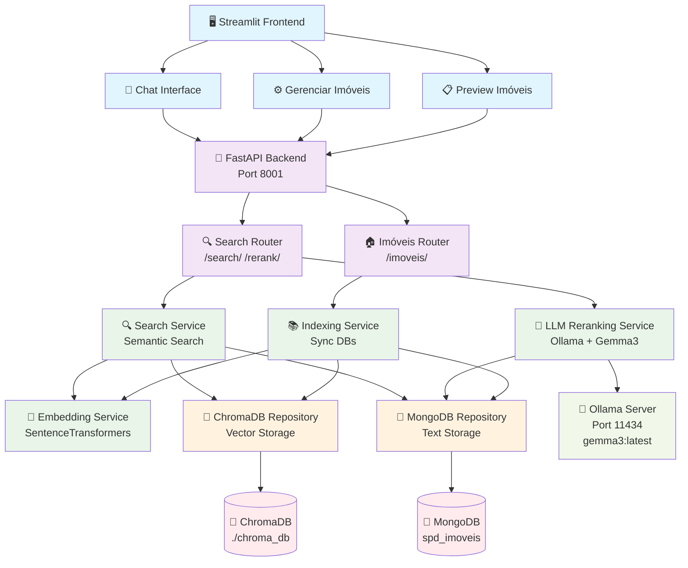
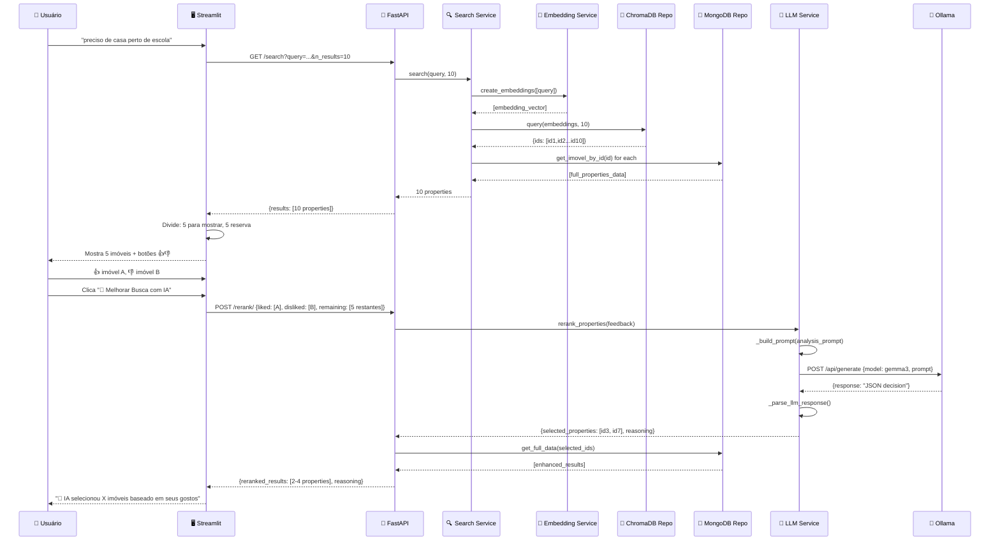
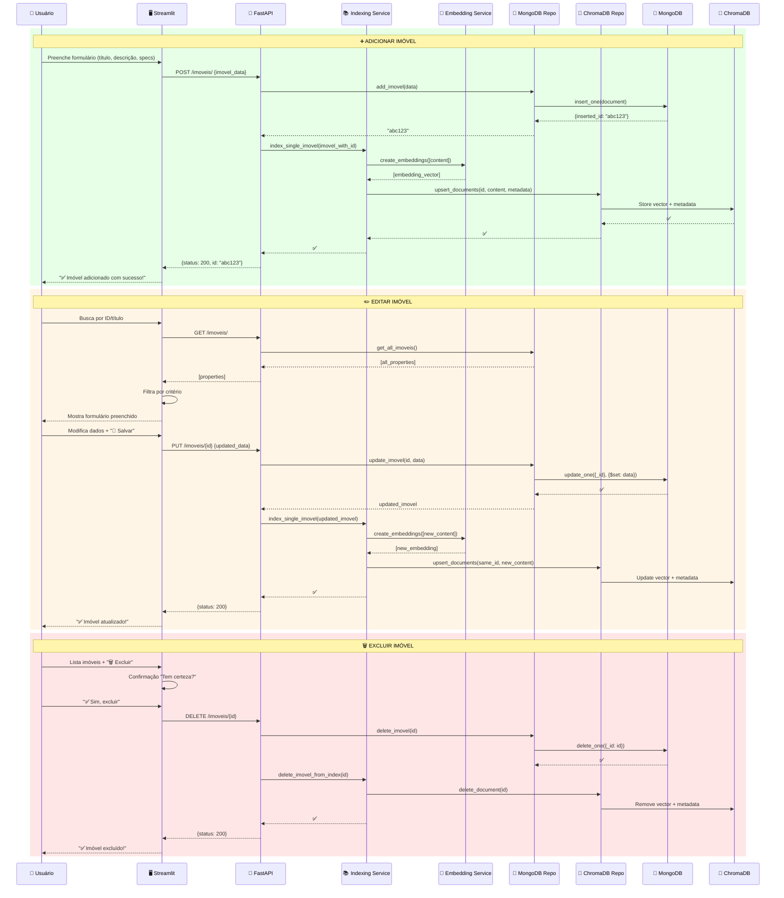

# 🏗️ Arquitetura Completa - Sistema de Busca Semântica para Imóveis

## 📊 Diagrama da Solução Completa

## 🔄 Fluxo 1: Chat com Busca Semântica + Re-ranking LLM

## 🏠 Fluxo 2: Gerenciamento de Imóveis (CRUD)

## 🧠 Componentes da Arquitetura

### 🎨 **Frontend Layer (Streamlit)**
- **Chat Interface**: Busca conversacional + feedback system
- **Gerenciar Imóveis**: CRUD completo (Create, Read, Update, Delete)
- **Preview**: Visualização dos primeiros 5 imóveis

### 🔌 **API Layer (FastAPI)**
- **Search Router**: `/search/` (busca semântica) + `/rerank/` (LLM re-ranking)
- **Imóveis Router**: `/imoveis/` (CRUD operations)

### ⚙️ **Services Layer**
- **Search Service**: Orquestra busca semântica (ChromaDB → MongoDB)
- **Embedding Service**: SentenceTransformers (all-MiniLM-L6-v2)
- **Indexing Service**: Sincronização MongoDB ↔ ChromaDB
- **LLM Reranking Service**: Integração Ollama + Gemma3

### 🗃️ **Repository Layer**
- **MongoDB Repository**: CRUD text data
- **ChromaDB Repository**: Vector operations

### 💾 **Database Layer**
- **MongoDB**: Armazenamento de texto (título, descrição, especificações)
- **ChromaDB**: Armazenamento de vetores + metadata

### 🤖 **External Services**
- **Ollama Server**: Servidor LLM local (Gemma3:latest)

## 🔑 Características Arquiteturais

### ✅ **Clean Architecture**
- **Dependency Inversion**: Services dependem de abstrações (repositories)
- **Single Responsibility**: Cada camada tem responsabilidade específica
- **Separation of Concerns**: Frontend, API, Business Logic, Data isolados

### 🚀 **Performance & Scalability**
- **Dual Database**: MongoDB (text) + ChromaDB (vectors) otimizado para cada tipo
- **Embedding Cache**: Vetores pré-computados para busca rápida
- **Async Operations**: FastAPI com async/await

### 🔒 **Reliability**
- **Fallback Mechanisms**: TF-IDF quando embeddings falham
- **Error Handling**: Try/catch em todas as camadas
- **Data Consistency**: Transações sincronizadas entre MongoDB e ChromaDB

### 🧪 **AI Integration**
- **Semantic Search**: SentenceTransformers para similaridade semântica
- **LLM Re-ranking**: Gemma3 para análise de preferências
- **Human-in-the-loop**: Feedback explícito para melhoria contínua

## 📈 Fluxo de Dados

1. **Ingestão**: Seed → MongoDB → Embedding → ChromaDB
2. **Busca**: Query → Embedding → ChromaDB (similarity) → MongoDB (content)
3. **Feedback**: User likes/dislikes → LLM analysis → Smart selection
4. **CRUD**: Frontend → API → MongoDB + ChromaDB sync

Esta arquitetura garante **escalabilidade**, **manutenibilidade** e **performance** para um sistema de busca semântica de imóveis com re-ranking inteligente! 🏗️✨