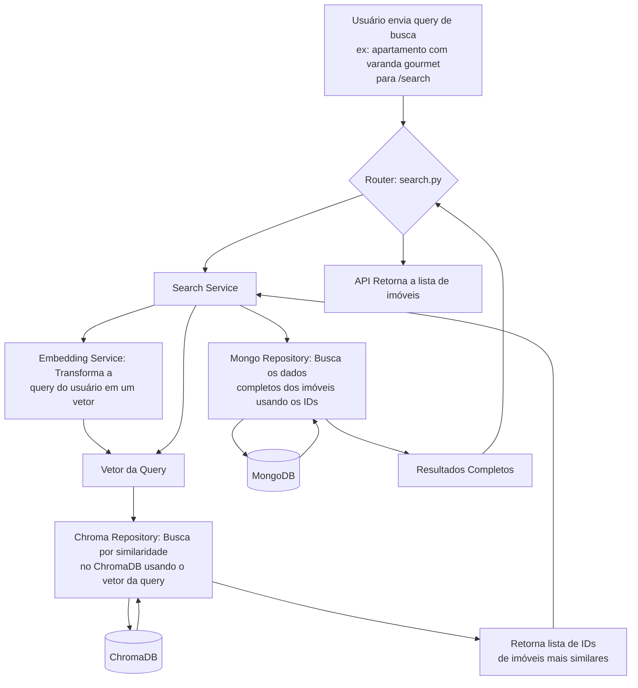

```mermaid
graph TD
    A[Usuário envia query de busca<br>ex: apartamento com varanda gourmet<br>para /search] --> R{Router: search.py};
    R --> SS[Search Service];
    SS --> ES[Embedding Service: Transforma a<br>query do usuário em um vetor];
    ES --> VQ[Vetor da Query];
    SS --> VQ;
    VQ --> CR[Chroma Repository: Busca por similaridade<br>no ChromaDB usando o vetor da query];
    CR --> ChromaDB[(ChromaDB)];
    ChromaDB --> CR;
    CR --> ID_List[Retorna lista de IDs<br>de imóveis mais similares];
    ID_List --> SS;
    SS --> MR[Mongo Repository: Busca os dados<br>completos dos imóveis usando os IDs];
    MR --> MongoDB[(MongoDB)];
    MongoDB --> MR;
    MR --> Results[Resultados Completos];
    Results --> R;
    R --> RESP[API Retorna a lista de imóveis];
```