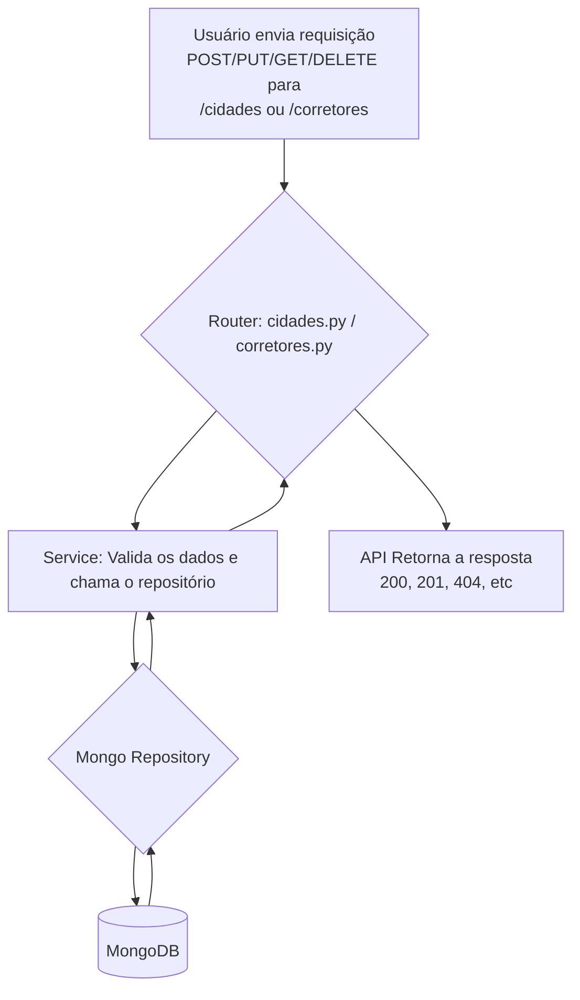

```mermaid
graph TD
    A[Usuário envia requisição<br/>POST/PUT/GET/DELETE para<br/>/cidades ou /corretores] --> R{Router: cidades.py / corretores.py}
    R --> S[Service: Valida os dados e chama o repositório]
    S --> REPO{Mongo Repository}
    REPO --> DB[(MongoDB)]
    DB --> REPO
    REPO --> S
    S --> R
    R --> RESP[API Retorna a resposta<br/>200, 201, 404, etc]
```