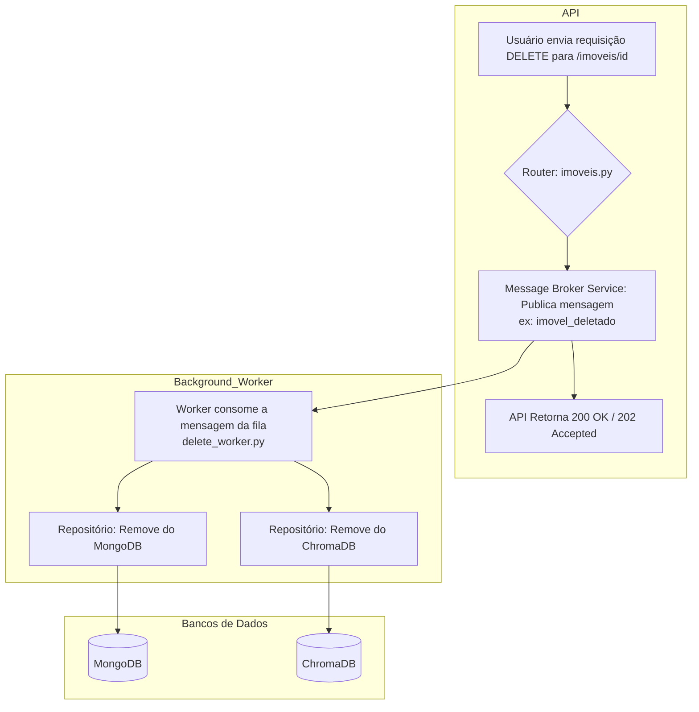

```mermaid
graph TD
    subgraph API
        A[Usuário envia requisição DELETE para /imoveis/id] --> R{Router: imoveis.py};
        R --> MB[Message Broker Service: Publica mensagem<br>ex: imovel_deletado];
        MB --> RESP[API Retorna 200 OK / 202 Accepted];
    end

    subgraph Background_Worker
        W[Worker consome a mensagem da fila<br>delete_worker.py];
        MB --> W;
        W --> D1[Repositório: Remove do MongoDB];
        W --> D2[Repositório: Remove do ChromaDB];
    end

    subgraph Bancos de Dados
        D1 --> MongoDB[(MongoDB)];
        D2 --> ChromaDB[(ChromaDB)];
    end
```