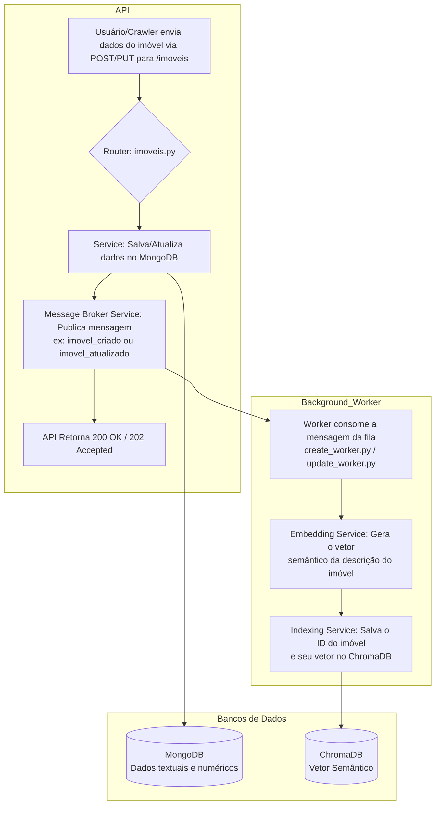

```mermaid
graph TD
    subgraph API
        A[Usuário/Crawler envia dados do imóvel via POST/PUT para /imoveis] --> R{Router: imoveis.py};
        R --> S1[Service: Salva/Atualiza dados no MongoDB];
        S1 --> MB[Message Broker Service: Publica mensagem<br>ex: imovel_criado ou imovel_atualizado];
        MB --> RESP[API Retorna 200 OK / 202 Accepted];
    end

    subgraph Background_Worker
        W[Worker consome a mensagem da fila<br>create_worker.py / update_worker.py];
        MB --> W;
        W --> ES[Embedding Service: Gera o vetor<br>semântico da descrição do imóvel];
        ES --> IS[Indexing Service: Salva o ID do imóvel<br>e seu vetor no ChromaDB];
    end

    subgraph Bancos de Dados
        S1 --> MongoDB[(MongoDB<br>Dados textuais e numéricos)];
        IS --> ChromaDB[(ChromaDB<br>Vetor Semântico)];
    end
```