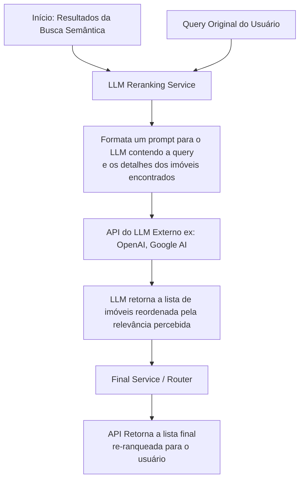

```mermaid
graph TD
    A[Início: Resultados da Busca Semântica] --> LRS[LLM Reranking Service];
    B[Query Original do Usuário] --> LRS;
    
    LRS --> P[Formata um prompt para o LLM contendo a query<br>e os detalhes dos imóveis encontrados];
    
    P --> LLM[API do LLM Externo ex: OpenAI, Google AI ];
    LLM --> Reordered[LLM retorna a lista de imóveis reordenada pela relevância percebida];
    
    Reordered --> FS[Final Service / Router];
    FS --> RESP[API Retorna a lista final<br>re-ranqueada para o usuário];

```