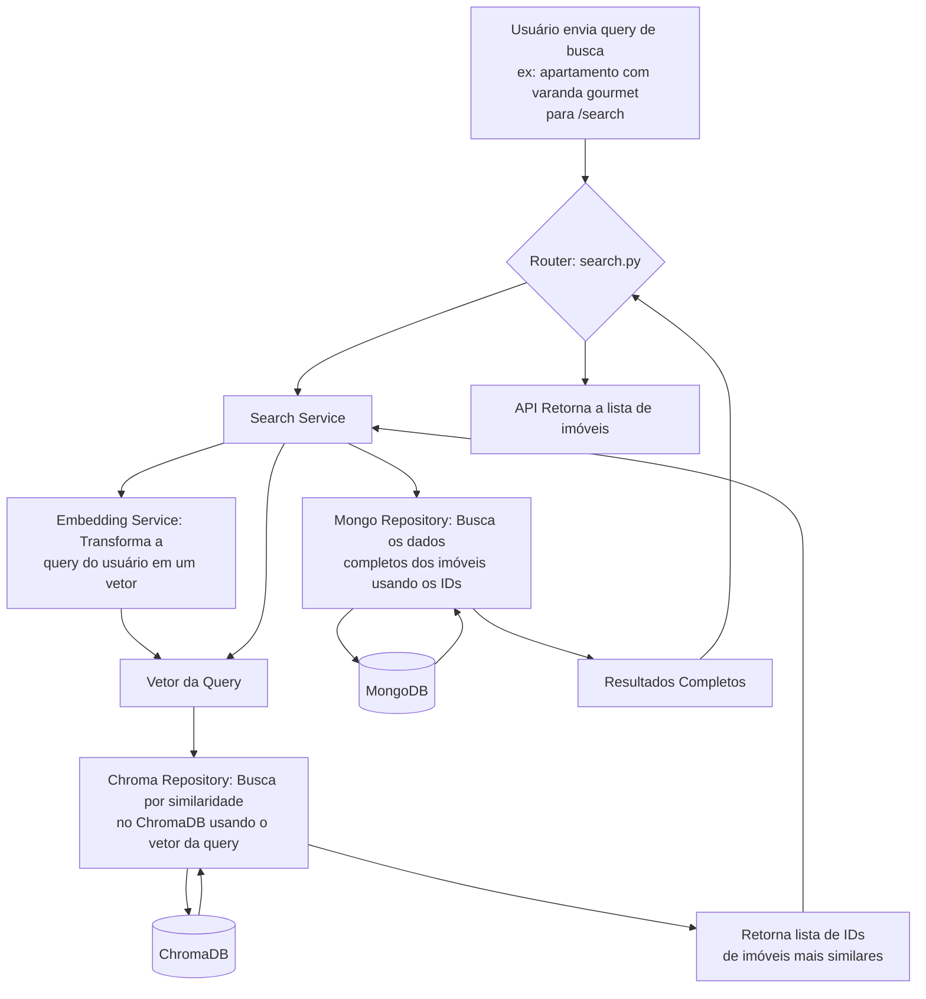
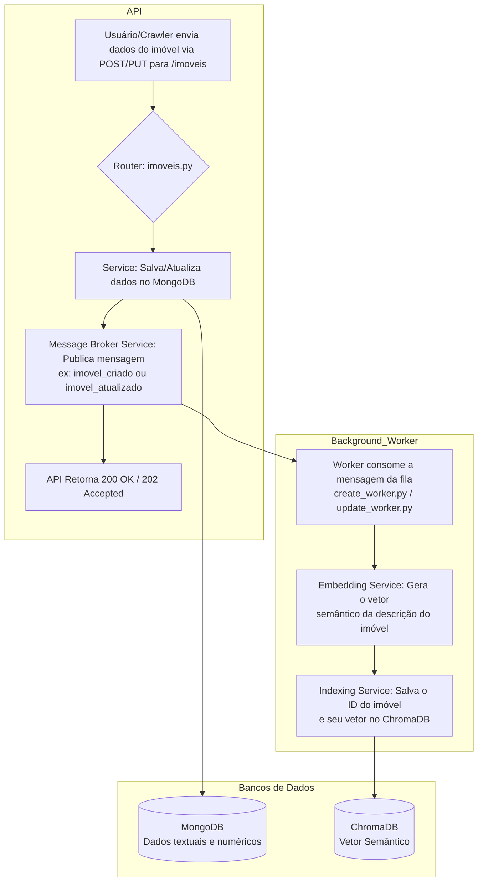
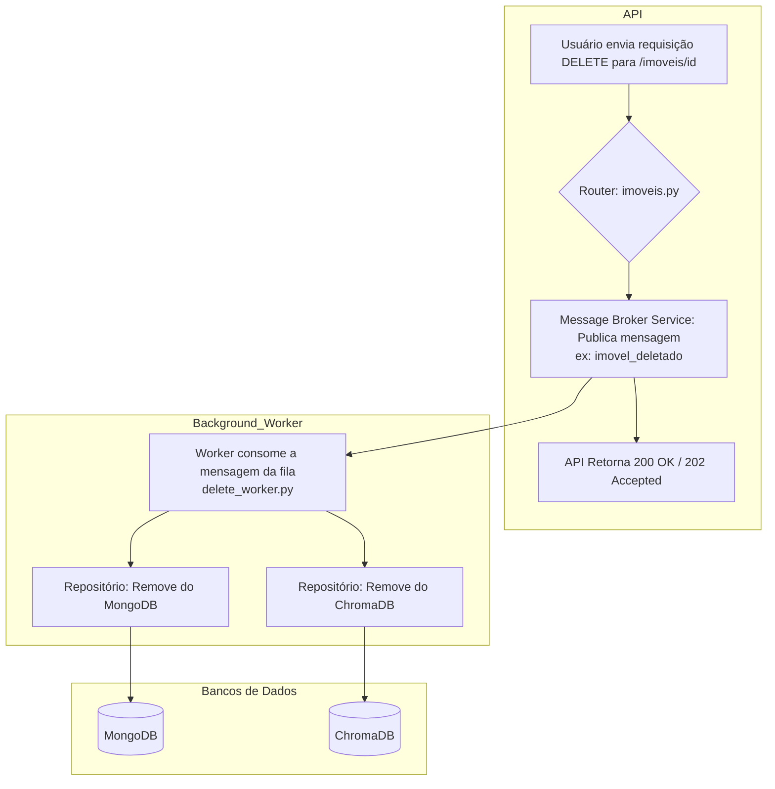
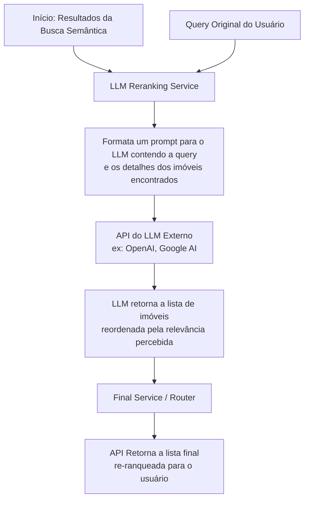
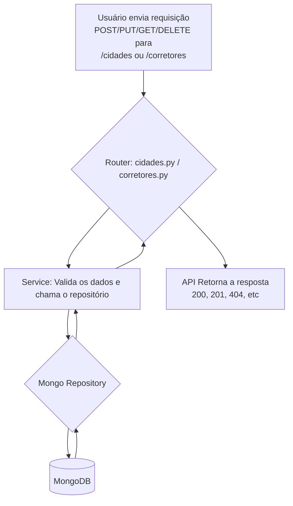

# SPD Imóveis - Docker Setup

## Inicialização Completa via Docker

### Comando Único para Iniciar Tudo
```bash
docker-compose up -d
```

### Parar Sistema
```bash
docker-compose down
```

### Rebuild após Mudanças no Código
```bash
docker-compose up -d --build
```

## Serviços Disponíveis

| Serviço | Container | Porta | URL |
|---------|-----------|-------|-----|
| API | spd_api | 8000 | http://localhost:8000 |
| Streamlit | spd_streamlit | 8501 | http://localhost:8501 |
| MongoDB | mongo_db | 27017 | mongodb://localhost:27017 |
| ChromaDB | chroma_db | 7777 | http://localhost:7777 |
| Redis | redis_broker | 6379 | redis://localhost:6379 |
| Worker | spd_worker | - | Background |

## Arquitetura do Sistema

```
┌─────────────┐    ┌─────────────┐    ┌─────────────┐
│  Streamlit  │────│     API     │────│   Worker    │
│    :8501    │    │    :8000    │    │ (background)│
└─────────────┘    └─────────────┘    └─────────────┘
                           │                   │
                   ┌───────┴───────┐          │
                   │               │          │
            ┌──────▼──────┐ ┌──────▼──────┐   │
            │   MongoDB   │ │   ChromaDB  │   │
            │    :27017   │ │    :7777    │   │
            └─────────────┘ └─────────────┘   │
                                              │
                           ┌──────────────────┘
                           │
                    ┌──────▼──────┐
                    │    Redis    │
                    │    :6379    │
                    └─────────────┘
```

## Fluxos do Sistema

### Fluxo de Busca Semântica



### Fluxo de Inserção/Atualização de Imóveis



### Fluxo de Deleção de Imóveis



### Fluxo de Reranking com LLM



### Fluxo CRUD de Cidades e Corretores



## Volumes Persistentes

- `mongo_data`: Dados do MongoDB
- `chroma_data`: Dados do ChromaDB  
- `redis_data`: Dados do Redis
- `./chroma_db`: ChromaDB local (desenvolvimento)
- `./models`: Modelos de ML

## Health Checks

Todos os serviços possuem health checks configurados:
- **MongoDB**: `mongosh --eval "db.adminCommand('ping')"`
- **ChromaDB**: `curl -f http://localhost:7777/api/v1/heartbeat`
- **Redis**: `redis-cli ping`
- **API**: `curl -f http://localhost:8000/`

## Logs dos Containers

```bash
# Ver logs de todos os serviços
docker-compose logs -f

# Ver logs de um serviço específico
docker-compose logs -f api
docker-compose logs -f worker
docker-compose logs -f streamlit
```

## Comandos Úteis

```bash
# Status dos containers
docker-compose ps

# Rebuild apenas um serviço
docker-compose up -d --build api

# Executar comando em container
docker-compose exec api bash
docker-compose exec mongodb mongosh

# Limpar volumes (CUIDADO: perde dados)
docker-compose down -v
```

## Diferenças dos Scripts Python

Os scripts `start_system.py` e `stop_system.py` não são mais necessários. Todo o gerenciamento é feito pelo Docker Compose:

- ✅ **Antes**: `python start_system.py`
- ✅ **Agora**: `docker-compose up -d`

- ✅ **Antes**: `python stop_system.py`  
- ✅ **Agora**: `docker-compose down`

## Troubleshooting

### Container não inicia
```bash
docker-compose logs [service_name]
```

### Portas ocupadas
```bash
# Verificar o que está usando a porta
lsof -i :8000
lsof -i :8501
```

### Reset completo
```bash
docker-compose down -v
docker system prune -f
docker-compose up -d --build
```