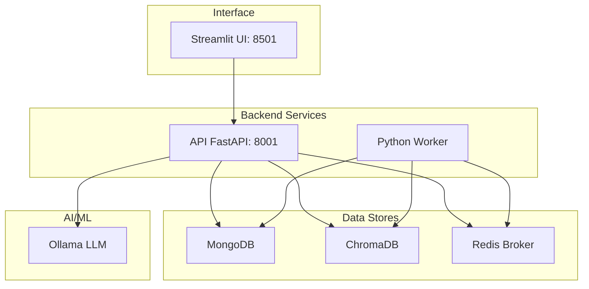
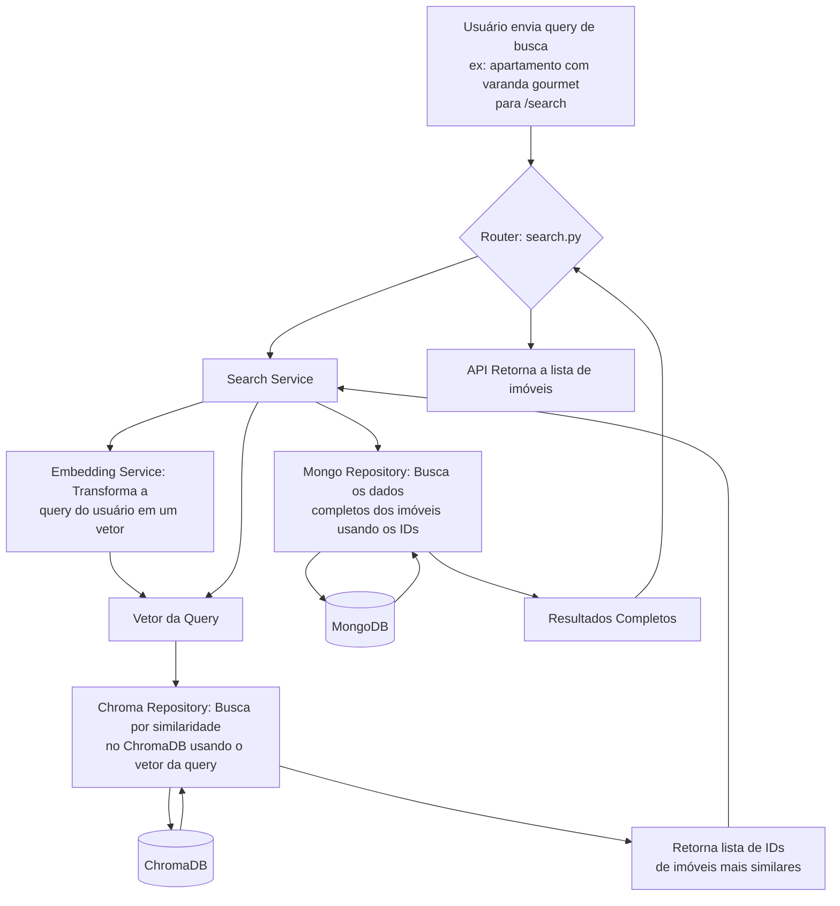
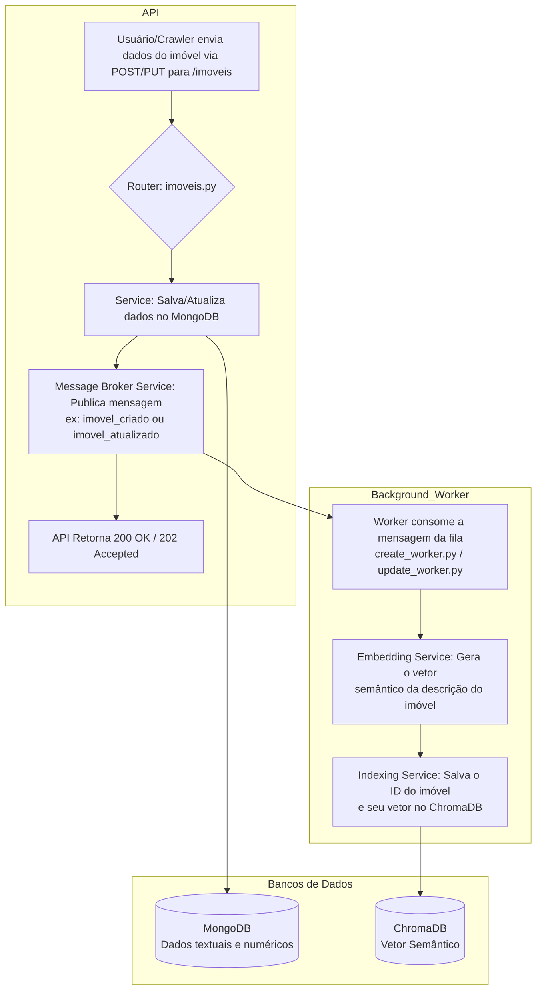
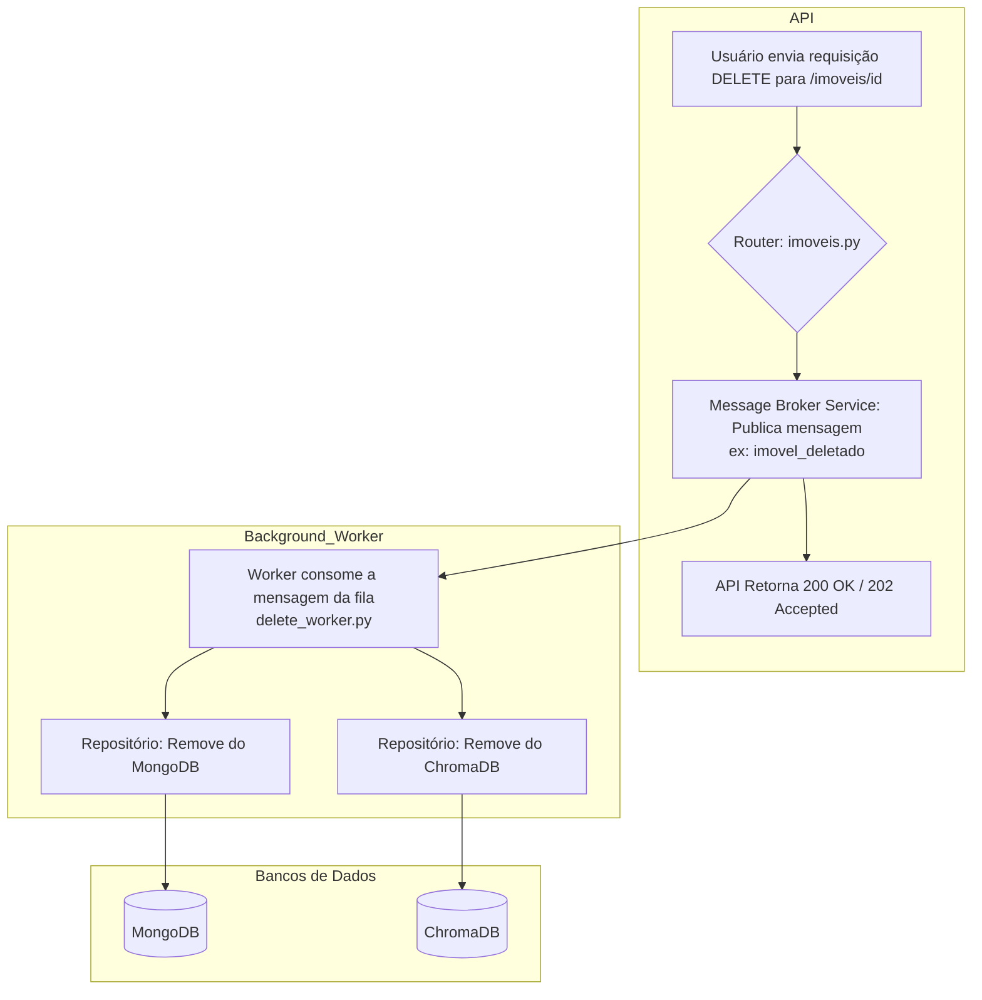
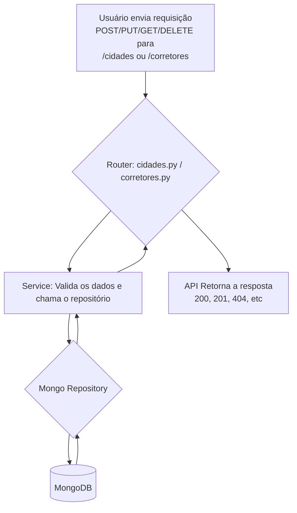

# Sistema de Busca Semântica para Imóveis

Este projeto implementa um sistema completo de busca semântica para o mercado imobiliário. Ele utiliza processamento de linguagem natural (PLN) para entender as buscas dos usuários (ex: "apartamento perto de um parque com 2 quartos") e encontrar os imóveis mais relevantes em um banco de dados.

A solução é totalmente containerizada com Docker, facilitando a configuração e execução do ambiente.

## Arquitetura do Sistema

O sistema é composto por vários serviços que se comunicam entre si, orquestrados pelo Docker Compose.



## Fluxos do Sistema

### Fluxo de Busca Semântica



### Fluxo de Inserção/Atualização de Imóveis



### Fluxo de Deleção de Imóveis



### Fluxo de Reranking com LLM

```mermaid
graph TD
    A[Início: Resultados da Busca Semântica] --> LRS[LLM Reranking Service];
    B[Query Original do Usuário] --> LRS;
    
    LRS --> P[Formata um prompt para o LLM contendo a query<br>e os detalhes dos imóveis encontrados];
    
    P --> LLM[API do LLM Externo<br>(ex: OpenAI, Google AI)];
    LLM --> Reordered[LLM retorna a lista de imóveis<br>reordenada pela relevância percebida];
    
    Reordered --> FS[Final Service / Router];
    FS --> RESP[API Retorna a lista final<br>re-ranqueada para o usuário];

```

### Fluxo CRUD de Cidades e Corretores



---

## Pré-requisitos

- [Docker](https://docs.docker.com/get-docker/)
- [Docker Compose](https://docs.docker.com/compose/install/)

---

## Como Executar o Projeto

1.  **Clone o repositório:**
    ```bash
    git clone <URL_DO_REPOSITORIO>
    cd versao-final
    ```

2.  **Suba os containers:**

    Para iniciar todos os serviços em background, execute:
    ```bash
    docker-compose up -d
    ```
    Na primeira vez, o Docker irá baixar as imagens e construir os containers, o que pode levar alguns minutos.

3.  **Acesse os serviços:**

    Após a inicialização, os seguintes serviços estarão disponíveis:

    | Serviço | URL | Descrição |
    | :--- | :--- | :--- |
    | 🖥️ **Interface Web** | [http://localhost:8501](http://localhost:8501) | Interface principal para busca de imóveis. |
    |  FastAPI | [http://localhost:8001/docs](http://localhost:8001/docs) | Documentação interativa da API (Swagger). |
    | 🍃 MongoDB | `mongodb://localhost:27017` | Banco de dados principal. |
    | 🧠 ChromaDB | `http://localhost:7777` | Banco de dados vetorial para busca semântica. |
    | 📦 Redis | `redis://localhost:6890` | Message broker para tarefas assíncronas. |
    | 🤖 Ollama | `http://localhost:11435` | Serviço para execução de modelos de linguagem (LLM). |

4.  **Parando o sistema:**

    Para parar todos os containers, execute:
    ```bash
    docker-compose down
    ```
    Para parar e remover os volumes de dados (reset completo), use:
    ```bash
    docker-compose down -v
    ```

---

## Desenvolvimento

### Visualizando Logs

Para acompanhar os logs de todos os serviços em tempo real:
```bash
docker-compose logs -f
```

Para ver os logs de um serviço específico (ex: `api` ou `worker`):
```bash
docker-compose logs -f api
```

### Reconstruindo Imagens

Se você fizer alterações no código-fonte (ex: `main.py` ou `single_worker.py`), precisará reconstruir as imagens dos containers correspondentes:
```bash
docker-compose up -d --build
```
Para reconstruir apenas um serviço:
```bash
docker-compose up -d --build api
```

### Acessando um Container

Para abrir um terminal interativo dentro de um container em execução (útil para depuração):
```bash
# Acessar o container da API
docker-compose exec api bash

# Acessar o container do MongoDB
docker-compose exec mongodb mongosh
```

---

## Troubleshooting

-   **Erro de porta ocupada (`port is already allocated`):**
    Verifique se outro processo em sua máquina já está usando uma das portas do projeto (8501, 8001, 27017, etc.). Pare o processo conflitante ou altere a porta no arquivo `docker-compose.yml`.

-   **Container não inicia:**
    Use `docker-compose logs <nome_do_servico>` para verificar a causa do erro.

-   **Reset completo do ambiente:**
    Se algo der muito errado, o comando a seguir irá parar os containers, remover os volumes de dados (cuidado, isso apaga os bancos de dados) e limpar recursos não utilizados do Docker.
    ```bash
    docker-compose down -v
    docker system prune -a -f
    ```
