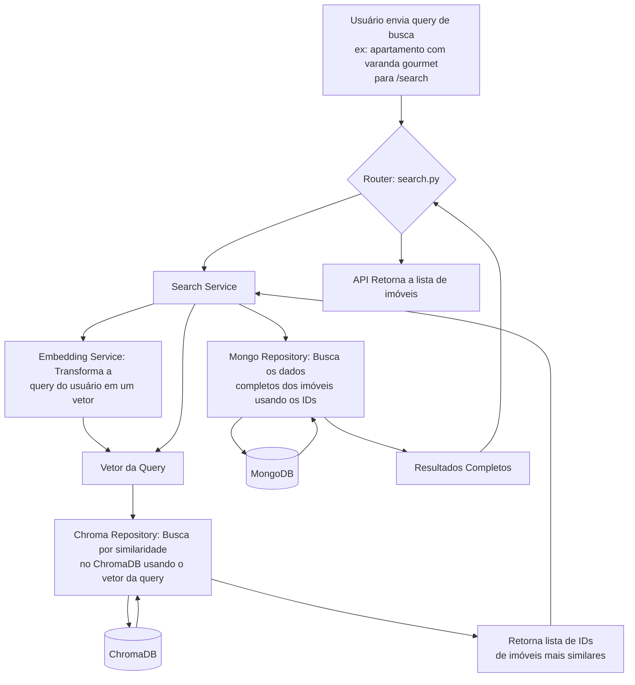
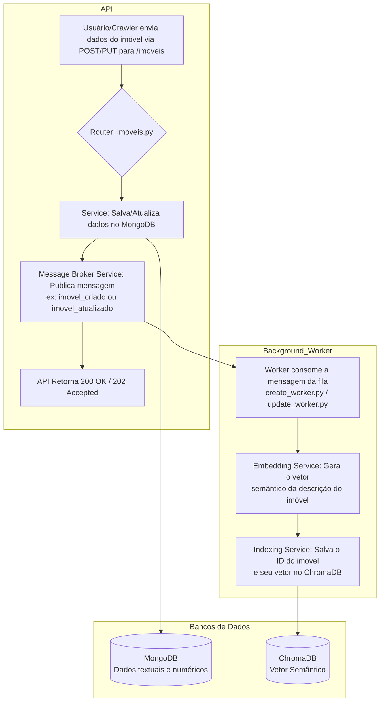
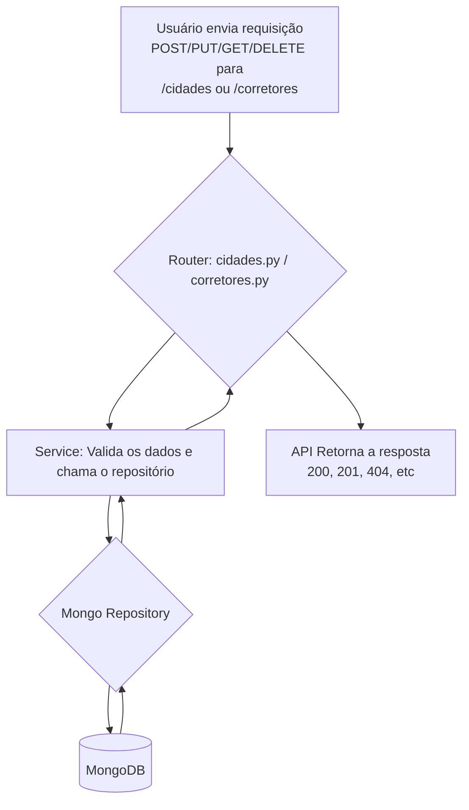

# SPD Imóveis - Interface Streamlit

Interface web completa para o sistema de busca semântica de imóveis.

## Como usar

```bash
# Certifique-se de que a API está rodando
source venv/bin/activate
python -m uvicorn main:app --host 0.0.0.0 --port 8001

# Em outro terminal, inicie o Streamlit
streamlit run streamlit/app.py
```

## Funcionalidades

### Preview
- Exibe os 5 primeiros imóveis cadastrados
- Cartões com informações resumidas
- Botão para ver detalhes

### Chat Inteligente
- Busca semântica por linguagem natural
- Interface de chat intuitiva
- Resultados formatados e organizados

### Gerenciar Imóveis
- **Adicionar:** Formulário completo para novos imóveis
- **Listar:** Visualização de todos os imóveis cadastrados  
- **Editar:** Busca por ID ou título + formulário de edição
- **Excluir:** Lista com confirmação de exclusão

## Exemplos de Busca

- "apartamento 3 quartos"
- "casa com piscina"  
- "imóvel no centro"
- "apartamento barato"

## Fluxos do Sistema

### Fluxo de Busca Semântica



### Fluxo de Inserção/Atualização de Imóveis



### Fluxo de Deleção de Imóveis

```mermaid
graph TD
    subgraph API
        A[Usuário envia requisição DELETE para /imoveis/{id}] --> R{Router: imoveis.py};
        R --> MB[Message Broker Service: Publica mensagem<br>ex: imovel_deletado];
        MB --> RESP[API Retorna 200 OK / 202 Accepted];
    end

    subgraph Background_Worker
        W[Worker consome a mensagem da fila<br>delete_worker.py];
        MB --> W;
        W --> D1[Repositório: Remove do MongoDB];
        W --> D2[Repositório: Remove do ChromaDB];
    end

    subgraph Bancos de Dados
        D1 --> MongoDB[(MongoDB)];
        D2 --> ChromaDB[(ChromaDB)];
    end
```

### Fluxo de Reranking com LLM

```mermaid
graph TD
    A[Início: Resultados da Busca Semântica] --> LRS[LLM Reranking Service];
    B[Query Original do Usuário] --> LRS;
    
    LRS --> P[Formata um prompt para o LLM contendo a query<br>e os detalhes dos imóveis encontrados];
    
    P --> LLM[API do LLM Externo<br>(ex: OpenAI, Google AI)];
    LLM --> Reordered[LLM retorna a lista de imóveis<br>reordenada pela relevância percebida];
    
    Reordered --> FS[Final Service / Router];
    FS --> RESP[API Retorna a lista final<br>re-ranqueada para o usuário];

```

### Fluxo CRUD de Cidades e Corretores

